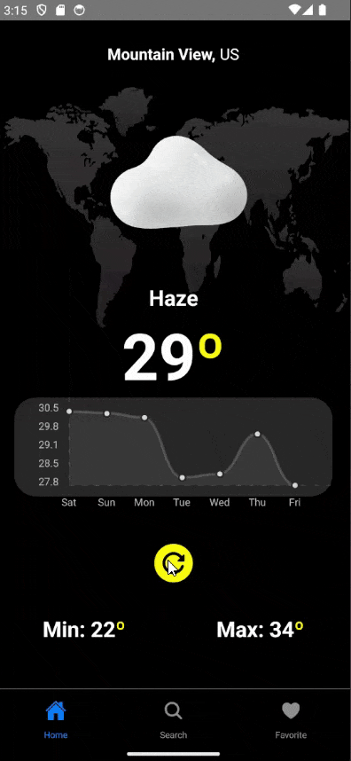

<h1 align="center">Weather Apps</h1>

<p align="center">This project is an application that displays weather data, search & save to favorite</p>

---

<br>

<h1 align="center">
  
</h1>

### Features

- [x] Icons change according to weather
- [x] Weather API consumption
- [x] User location retrieval
- [x] Refresh data button
- [x] City search
- [x] Favorite List

### Running the Mobile App

```bash
# Clone this repository
$ git clone https://github.com/fadhildwia/weather.git

# Navigate into the project folder in your terminal/cmd
$ cd Weather

# Make a copy of '.env.example' to '.env'
# Put your Weather API credential in .env file
$ cp .env.example .env

# Install dependencies
$ yarn

# If you're emulating with Android, run this command
# Make sure your emulator is open
$ yarn android
```
