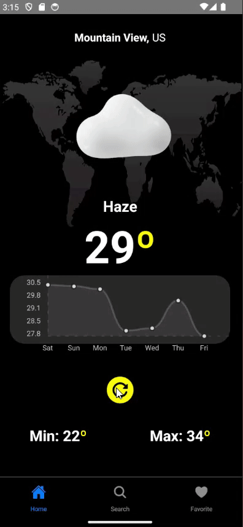

<h1 align="center">Weather Apps</h1>

<p align="center">This project is an application that displays weather data, search & save to favorite</p>

---

<br>

### Detail Apps on Android

<h1 align="center">
  
</h1>

## 📱 Features

- Icons change according to weather
- Weather API consumption
- User location retrieval
- Refresh data button
- City search
- Favorite List

## 🚀 Technologies & Resources

- [x] [React Native](https://reactnative.dev/docs/getting-started-without-a-framework)
- [x] [Async Storage](https://react-native-async-storage.github.io/async-storage/docs/install/)
- [x] [Axios](https://reactnavigation.org/docs/getting-started/)
- [x] [React Navigation](https://reactnavigation.org/docs/getting-started/)
- [x] [React Query](https://tanstack.com/query/v3)
- [x] [Formik](https://formik.org/docs/overview)
- [x] [React Native Chart Kit](https://www.npmjs.com/package/react-native-chart-kit)
- [x] [React Native Geolocation Service](https://www.npmjs.com/package/react-native-geolocation-service)
- [x] [Styled Comoponents](https://styled-components.com/docs)
- [x] [Yup](https://www.npmjs.com/package/yup)

## 💻 Installation

1. #### Clone the repository:

   ```bash
   git clone https://github.com/fadhildwia/weather.git
   ```

2. #### Navigate to the project directory:

   ```bash
   cd weather
   ```

3. #### Install the dependencies:
   ```bash
   yarn
   #or
   npm install
   ```
4. #### Make a copy of `.env.example` to `.env`:
   ```bash
   # Put your Weather API credential in .env file
   cp .env.example .env
   ```
5. #### Run the project:
   ```bash
   yarn android
   #or
   npm run android
   ```

<!-- ## License

This example application is licensed under the [MIT License](LICENSE).

--- -->

---

Feel free to explore the code and adapt it to suit your needs! If you encounter any issues or have suggestions for improvements, please don't hesitate to open an issue or submit a pull request.
